# Actividad No. 3

## Nombre: Luis Eduardo De León Pacheco - Carnet: 202000959

### Parte 1: Creación de Usuarios

1.Crear Usuarios

``` bash
sudo adduser usuario1
sudo adduser usuario2
sudo adduser usuario3
```

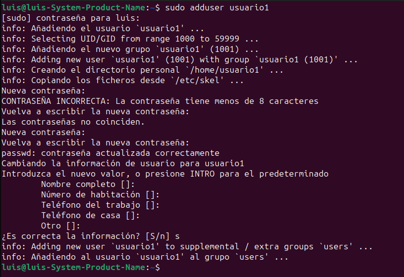

2.Asignar nuevas Contraseñas
usuariolinux

``` bash
sudo passwd usuario1
sudo passwd usuario2
sudo passwd usuario3
```

3.Información de los usuarios

```bash
id usuario1
```

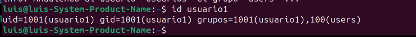

4.Eliminación de Usuarios conservando su directorio principal

```bash
sudo deluser --remove-home --backup-to /home/luis/Escritorio/Semestre-2024/SegundoSemestre/SistemasOperativos/backup_users
 usuario3
```

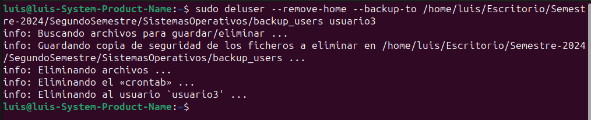
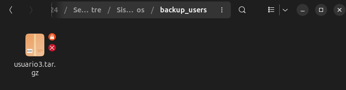

___

### Parte 2: Gestión de Grupos

1. Creación de Grupos

```bash
sudo addgroup grupo1
```

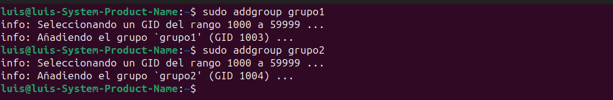

2.Agregar Usuarios a Grupos

```bash
sudo usermod -aG grupo1 usuario1
sudo usermod -aG grupo2 usuario2
```

3.Verificar Membresía

```bash
groups usuario1
groups usuario1
```

Resultado de los pasos 2 y 3:
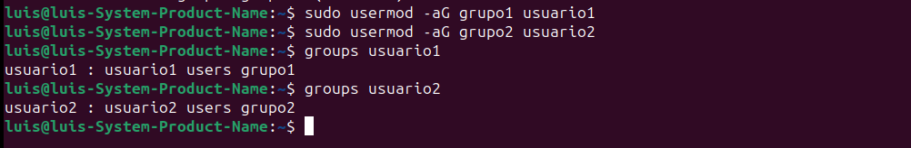

4.Eliminar Grupo

```bash
sudo delgroup grupo2
```

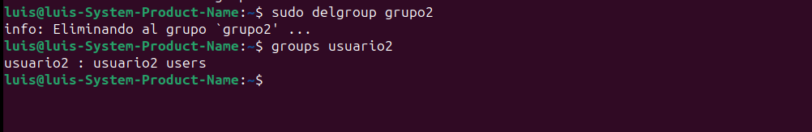

### Parte 3: Gestión de Permisos

1. Creación de Archivos y Directorios

    1.1 Iniciar sesión como usuario1

    1.2 Crear un archivo y escribir en el

    1.3 Crear un directorio y dentro un archivo llamado archivo 2

```bash
su - usuario1

echo "Hola desde el archivo1" > ~/archivo1.txt

mkdir ~/directorio1
echo "Contenido del archivo2" > ~/directorio1/archivo2.txt
```

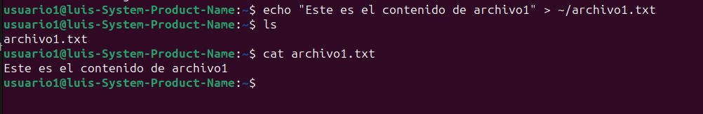
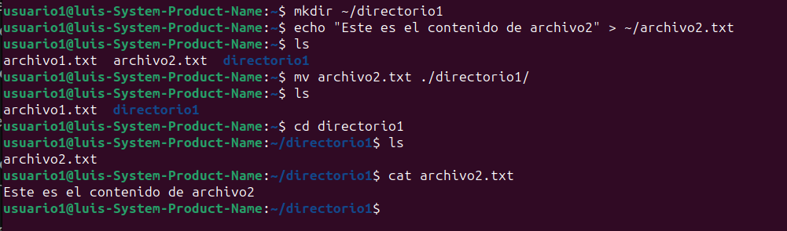

2. Verificar Permisos

```bash
ls -l ~/archivo1.txt
ls -ld ~/directorio1
ls -l ~/directorio1/archivo2.txt
```

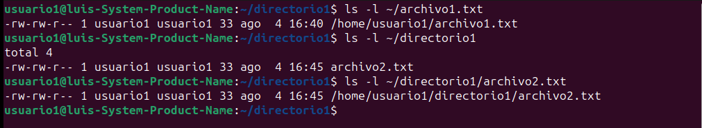

3. Modificar permisos usando chmod con Modo Númerico

```bash
chmod 640 ~/archivo1.txt
```

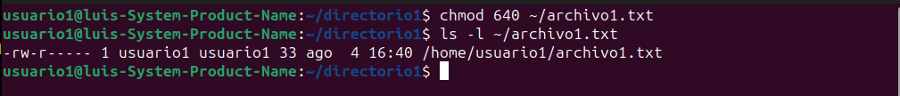

4. Modificar permisos usando chmod con Modo Simbólico

```bash
chmod u+x ~/directorio1/archivo2.txt
```

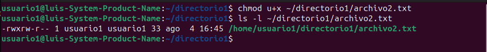

5. Cambiar el Grupo Propietario

```bash
sudo chown :grupo1 ~/directorio1/archivo2.txt
```

6. Configurar Permisos del directorio

```bash
chmod 750 ~/directorio1
```

7. Comprobación de acceso

```bash
su - usuario2
cat /home/usuario1/archivo1.txt
cd /home/usuario1/directorio1
cat /home/usuario1/directorio1/archivo2.txt
```

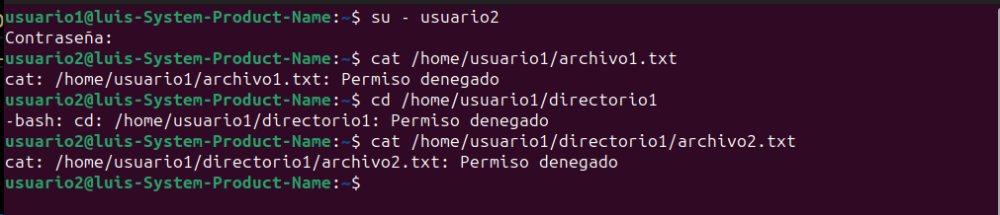

8. Verificación final

```bash
ls -l /home/usuario1/archivo1.txt
ls -ld /home/usuario1/directorio1
ls -l /home/usuario1/directorio1/archivo2.txt
```


___

#### REFLEXIÓN

*¿Por qué es importante gestionar correctamente los usuarios y permisos en un sistema operativo?*

Es importante por temas de seguridad, evitar accesos no autorizados y proteger los datos. El control del acceso asegura que solo los usuarios autorizados puedan modificar o ejecutar archivos. También la gestión correcta facilita la administración de recursos y mantiene el sistema ordenado.

*¿Qué otros comandos o técnicas conocen para gestionar permisos en Linux?*

chgrp: Cambia el grupo propietario de archivos y directorios.

umask: Establece los permisos predeterminados para nuevos archivos.

setfacl y getfacl: Gestiona permisos avanzados con listas de control de acceso (ACL).