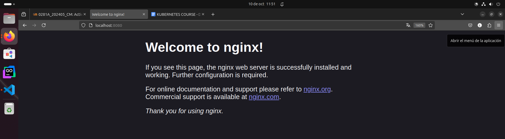

# Primeros pasos con K8s

## Nombre: Luis Eduardo De León Pacheco

### Carnet: 202000959

Se instaló minikube, y este es el pod creado:

```bash
luis@luis-System-Product-Name:~/Escritorio/Actividades/actividad8$ kubectl get pods -o wide
NAME                                         READY   STATUS             RESTARTS          AGE     IP             NODE       NOMINATED NODE   READINESS GATES
actividad8                                   1/1     Running            0                 22m     10.244.0.105   minikube   <none>           <none>
```

Se redirigieron los puertos para ver el web server

```bash
luis@luis-System-Product-Name:~/Escritorio/Actividades/actividad8$ kubectl port-forward pod/actividad8 8080:80
Forwarding from 127.0.0.1:8080 -> 80
Forwarding from [::1]:8080 -> 80
Handling connection for 8080
```

Web server Nginx:


### 

En un ambiente local de Kubernetes como Minikube o Kind el clúster solo se corre en un solo nodo como se ve a continuación:

```bash
luis@luis-System-Product-Name:~/Escritorio/Actividades/actividad8$ kubectl get nodes
NAME       STATUS   ROLES           AGE     VERSION
minikube   Ready    control-plane   2d14h   v1.31.0
```

Este único nodo actúa como master y como worker. El master gestiona el control de clúster como planificación, controladores etc., mientras que el worker ejecuta los contenedores.
